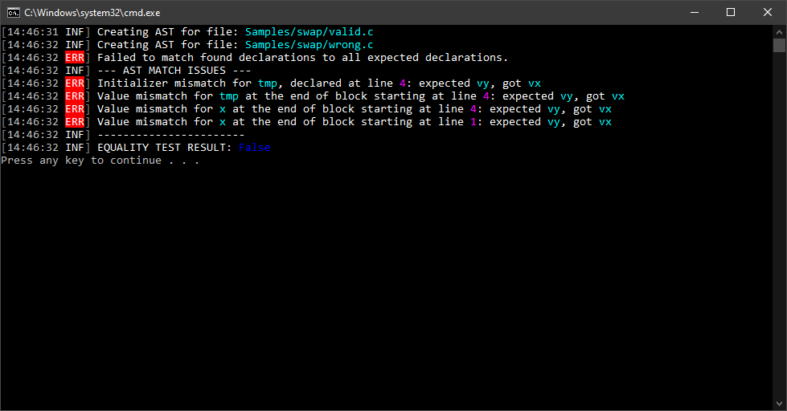
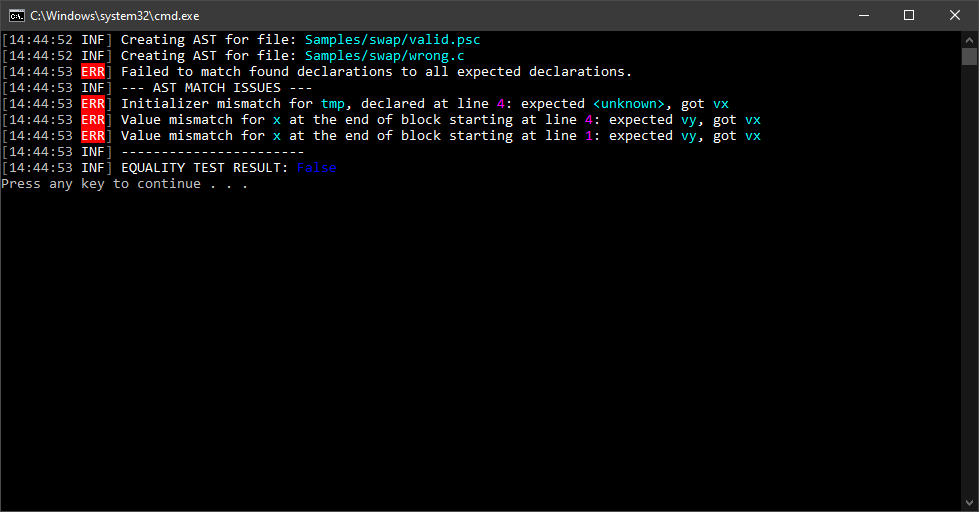

# CLI frontend for LINVAST libraries
[](https://github.com/LINVAST/CLI/issues)
[](https://github.com/LINVAST/CLI/releases)
[](https://github.com/LINVAST/CLI/releases)

## Examples

### Creating common AST

Source codes which show supported syntax constructs in one place for various programming languages can be found in the  directory. Several examples will be shown below.

```sh
$ linvast ast 
ERROR(S):
  A required value not bound to option name is missing.

  -v, --verbose    (Default: false) Verbose output

  -o, --output     Output path

  -c, --compact    (Default: false) Compact AST output

  --help           Display this help screen.

  --version        Display version information.

  value pos. 0     Required. Source path
```

#### AST created for C source:
```c
int gl_y = 2;
void f(int x);
int gl_x = 3;

int main()
{
	int x = 1;
	//printf("Hello world!% d\n", x);
	return 0;
}

static int gl_z;
```
```sh
$ linvast ast -v sample.c 
```

<details>
<summary>Click to expand!</summary>

```json
{
  "Name": null,
  "NodeType": "SourceNode",
  "Line": 1,
  "Children": [
    {
      "NodeType": "DeclStatNode",
      "Line": 1,
      "Children": [
        {
          "Modifiers": {
            "AccessModifiers": "Unspecified",
            "QualifierFlags": "None"
          },
          "TypeName": "int",
          "NodeType": "DeclSpecsNode",
          "Line": 1,
          "Children": []
        },
        {
          "NodeType": "DeclListNode",
          "Line": 1,
          "Children": [
            {
              "Pointer": false,
              "NodeType": "VarDeclNode",
              "Line": 1,
              "Children": [
                {
                  "Identifier": "gl_y",
                  "NodeType": "IdNode",
                  "Line": 1,
                  "Children": []
                },
                {
                  "Value": 2,
                  "Suffix": null,
                  "TypeCode": "Int32",
                  "NodeType": "LitExprNode",
                  "Line": 1,
                  "Children": []
                }
              ]
            }
          ]
        }
      ]
    },
    {
      "NodeType": "DeclStatNode",
      "Line": 3,
      "Children": [
        {
          "Modifiers": {
            "AccessModifiers": "Unspecified",
            "QualifierFlags": "None"
          },
          "TypeName": "void",
          "NodeType": "DeclSpecsNode",
          "Line": 3,
          "Children": []
        },
        {
          "NodeType": "DeclListNode",
          "Line": 3,
          "Children": [
            {
              "Pointer": false,
              "NodeType": "FuncDeclNode",
              "Line": 3,
              "Children": [
                {
                  "Identifier": "f",
                  "NodeType": "IdNode",
                  "Line": 3,
                  "Children": []
                },
                {
                  "IsVariadic": false,
                  "NodeType": "FuncParamsNode",
                  "Line": 3,
                  "Children": [
                    {
                      "NodeType": "FuncParamNode",
                      "Line": 3,
                      "Children": [
                        {
                          "Modifiers": {
                            "AccessModifiers": "Unspecified",
                            "QualifierFlags": "None"
                          },
                          "TypeName": "int",
                          "NodeType": "DeclSpecsNode",
                          "Line": 3,
                          "Children": []
                        },
                        {
                          "Pointer": false,
                          "NodeType": "VarDeclNode",
                          "Line": 3,
                          "Children": [
                            {
                              "Identifier": "x",
                              "NodeType": "IdNode",
                              "Line": 3,
                              "Children": []
                            }
                          ]
                        }
                      ]
                    }
                  ]
                }
              ]
            }
          ]
        }
      ]
    },
    {
      "NodeType": "DeclStatNode",
      "Line": 5,
      "Children": [
        {
          "Modifiers": {
            "AccessModifiers": "Unspecified",
            "QualifierFlags": "None"
          },
          "TypeName": "int",
          "NodeType": "DeclSpecsNode",
          "Line": 5,
          "Children": []
        },
        {
          "NodeType": "DeclListNode",
          "Line": 5,
          "Children": [
            {
              "Pointer": false,
              "NodeType": "VarDeclNode",
              "Line": 5,
              "Children": [
                {
                  "Identifier": "gl_x",
                  "NodeType": "IdNode",
                  "Line": 5,
                  "Children": []
                },
                {
                  "Value": 3,
                  "Suffix": null,
                  "TypeCode": "Int32",
                  "NodeType": "LitExprNode",
                  "Line": 5,
                  "Children": []
                }
              ]
            }
          ]
        }
      ]
    },
    {
      "NodeType": "FuncDefNode",
      "Line": 8,
      "Children": [
        {
          "Modifiers": {
            "AccessModifiers": "Unspecified",
            "QualifierFlags": "None"
          },
          "TypeName": "int",
          "NodeType": "DeclSpecsNode",
          "Line": 8,
          "Children": []
        },
        {
          "Pointer": false,
          "NodeType": "FuncDeclNode",
          "Line": 8,
          "Children": [
            {
              "Identifier": "main",
              "NodeType": "IdNode",
              "Line": 8,
              "Children": []
            }
          ]
        },
        {
          "NodeType": "BlockStatNode",
          "Line": 10,
          "Children": [
            {
              "NodeType": "DeclStatNode",
              "Line": 10,
              "Children": [
                {
                  "Modifiers": {
                    "AccessModifiers": "Unspecified",
                    "QualifierFlags": "None"
                  },
                  "TypeName": "int",
                  "NodeType": "DeclSpecsNode",
                  "Line": 10,
                  "Children": []
                },
                {
                  "NodeType": "DeclListNode",
                  "Line": 10,
                  "Children": [
                    {
                      "Pointer": false,
                      "NodeType": "VarDeclNode",
                      "Line": 10,
                      "Children": [
                        {
                          "Identifier": "x",
                          "NodeType": "IdNode",
                          "Line": 10,
                          "Children": []
                        },
                        {
                          "Value": 1,
                          "Suffix": null,
                          "TypeCode": "Int32",
                          "NodeType": "LitExprNode",
                          "Line": 10,
                          "Children": []
                        }
                      ]
                    }
                  ]
                }
              ]
            },
            {
              "Type": "Return",
              "NodeType": "JumpStatNode",
              "Line": 12,
              "Children": [
                {
                  "Value": 0,
                  "Suffix": null,
                  "TypeCode": "Int32",
                  "NodeType": "LitExprNode",
                  "Line": 12,
                  "Children": []
                }
              ]
            }
          ]
        }
      ]
    },
    {
      "NodeType": "DeclStatNode",
      "Line": 15,
      "Children": [
        {
          "Modifiers": {
            "AccessModifiers": "Unspecified",
            "QualifierFlags": "Static"
          },
          "TypeName": "int",
          "NodeType": "DeclSpecsNode",
          "Line": 15,
          "Children": []
        },
        {
          "NodeType": "DeclListNode",
          "Line": 15,
          "Children": [
            {
              "Pointer": false,
              "NodeType": "VarDeclNode",
              "Line": 15,
              "Children": [
                {
                  "Identifier": "gl_z",
                  "NodeType": "IdNode",
                  "Line": 15,
                  "Children": []
                }
              ]
            }
          ]
        }
      ]
    }
  ]
}
```
</details>


#### AST created for Lua source:
```lua
function fact (n)
  if n == 0 then
    return 1
  else
    return n * fact(n-1)
  end
end
```
```sh
$ linvast ast -vc sample.lua
```

<details>
<summary>Click to expand!</summary>

```json
{"Name":null,"NodeType":"SourceNode","Line":1,"Children":[{"NodeType":"FuncDefNode","Line":1,"Children":[{"Modifiers":{"AccessModifiers":"Unspecified","QualifierFlags":"None"},"TypeName":"object","NodeType":"DeclSpecsNode","Line":1,"Children":[]},{"Pointer":false,"NodeType":"FuncDeclNode","Line":1,"Children":[{"Identifier":"fact","NodeType":"IdNode","Line":1,"Children":[]},{"IsVariadic":false,"NodeType":"FuncParamsNode","Line":1,"Children":[{"NodeType":"FuncParamNode","Line":1,"Children":[{"Modifiers":{"AccessModifiers":"Unspecified","QualifierFlags":"None"},"TypeName":"object","NodeType":"DeclSpecsNode","Line":1,"Children":[]},{"Pointer":false,"NodeType":"VarDeclNode","Line":1,"Children":[{"Identifier":"n","NodeType":"IdNode","Line":1,"Children":[]}]}]}]}]},{"NodeType":"BlockStatNode","Line":2,"Children":[{"NodeType":"IfStatNode","Line":2,"Children":[{"NodeType":"RelExprNode","Line":2,"Children":[{"Identifier":"n","NodeType":"IdNode","Line":2,"Children":[]},{"Symbol":"==","NodeType":"RelOpNode","Line":2,"Children":[]},{"Value":0,"Suffix":null,"TypeCode":"Int32","NodeType":"LitExprNode","Line":2,"Children":[]}]},{"NodeType":"BlockStatNode","Line":3,"Children":[{"Type":"Return","NodeType":"JumpStatNode","Line":3,"Children":[{"NodeType":"ExprListNode","Line":3,"Children":[{"Value":1,"Suffix":null,"TypeCode":"Int32","NodeType":"LitExprNode","Line":3,"Children":[]}]}]}]},{"NodeType":"BlockStatNode","Line":5,"Children":[{"Type":"Return","NodeType":"JumpStatNode","Line":5,"Children":[{"NodeType":"ExprListNode","Line":5,"Children":[{"NodeType":"ArithmExprNode","Line":5,"Children":[{"Identifier":"n","NodeType":"IdNode","Line":5,"Children":[]},{"Symbol":"*","NodeType":"ArithmOpNode","Line":5,"Children":[]},{"NodeType":"FuncCallExprNode","Line":5,"Children":[{"Identifier":"fact","NodeType":"IdNode","Line":5,"Children":[]},{"NodeType":"ExprListNode","Line":5,"Children":[{"NodeType":"ArithmExprNode","Line":5,"Children":[{"Identifier":"n","NodeType":"IdNode","Line":5,"Children":[]},{"Symbol":"-","NodeType":"ArithmOpNode","Line":5,"Children":[]},{"Value":1,"Suffix":null,"TypeCode":"Int32","NodeType":"LitExprNode","Line":5,"Children":[]}]}]}]}]}]}]}]}]}]}]}]}
```
</details>


## Comparing common ASTs

Several samples can be found in the  directory. One sample will be shown below.

```sh 
$ linvast cmp
ERROR(S):
  A required value not bound to option name is missing.

  -v, --verbose    Set output to verbose messages.

  --help           Display this help screen.

  --version        Display version information.

  value pos. 0     Required. Specification path.

  value pos. 1     Required. Test source path.
```

### Example for swap sources

Sources:  

```sh
$ linvast cmp Samples/swap/valid.c Samples/swap/wrong.c
```




Sources:  

```sh
$ linvast cmp Samples/swap/valid.psc Samples/swap/wrong.c
```




Sources:   (*Note: Overflow is not checked at the moment*)

```sh
$ linvast cmp Samples/swap/valid.c Samples/swap/refactor.c
```


